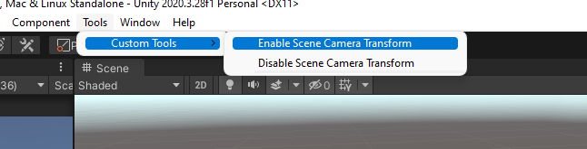
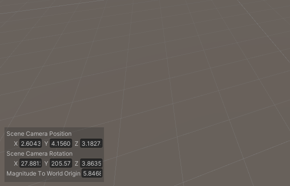

### scene-view-camera-tool
A simple tool for examining the coordinates of the scene camera.

## Table of Contents
- [Installation](#installation)
- [Usage](#usage)

# Installation

Just simply drag & drop [Scene View Camera Transform](src/SceneViewCameraTransform.cs). It's important to drop this file inside an Editor folder.

# Usage

